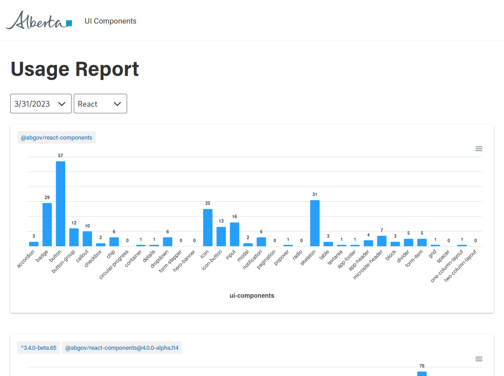

# Overview

Provides a report UI-Component library usage throughout all the Github repos

[Current Report](https://abgov-ui-component-usage.netlify.app/)

## Setup

You will need to obtain a personal access token with the following permissions
- repo:all
- admin:org
  - read:org
- project
  - read:project

Save the token in a `.env` file

```
GITHUB_API_TOKEN=[your token]
```

## Generate

```bash
npm run build:all     # analyzes all GoA repos
npm run build:report  # 
```

## View

```bash
npx serve report
```



